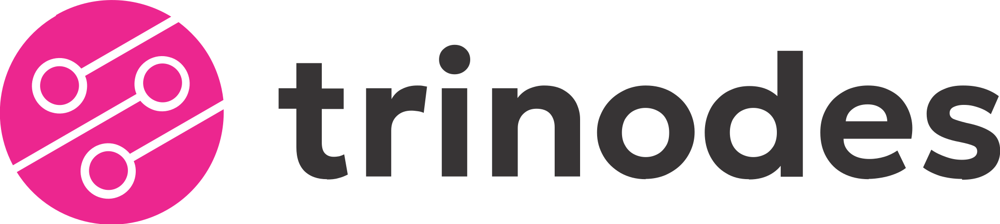

# ✨ TriNodes - Diseñamos experiencias, Construimos soluciones

<div align="center">
  
  
  ### Equipo multidisciplinario de desarrolladores y diseñadores UX
  
  [](https://angular.io/)
  [](https://www.typescriptlang.org/)
  [](https://tailwindcss.com/)
  
</div>

---

## 🚀 Sobre Nosotros

**TriNodes** es un equipo apasionado de profesionales especializados en la creación de productos digitales excepcionales. Transformamos ideas innovadoras en experiencias web memorables que impulsan el crecimiento de nuestros clientes.

### 👥 Nuestro Equipo

- **Francisco Larrosa** - Frontend Developer
- **Kevin Martinez** - Full Stack Developer  
- **Santiago Diaz Pace** - UX/Visual Designer

## 🎯 Servicios

### 🎨 Diseño UX/UI
Creamos interfaces intuitivas y experiencias memorables centradas en el usuario.

### 💻 Desarrollo Web
Construimos aplicaciones web modernas, escalables y de alto rendimiento.

### 📱 Responsive Design
Adaptamos tu sitio para que funcione perfectamente en cualquier dispositivo.

## 🛠️ Stack Tecnológico

- **Framework:** Angular 21 con Standalone Components
- **Lenguaje:** TypeScript con strict mode
- **Estilos:** TailwindCSS + CSS personalizado
- **Animaciones:** AOS (Animate On Scroll)
- **Iconos:** FontAwesome
- **Build:** Vite + esbuild

## ✨ Características

- ⚡ Arquitectura moderna con Angular Signals
- 🎨 Sistema de diseño glassmorphism
- 🌓 Dark mode con persistencia
- 📱 Diseño completamente responsive
- ♿ Accesible (WCAG AA compliant)
- 🚀 Optimizado para SEO
- 🎭 Animaciones suaves y profesionales
- 🔍 Metadatos Open Graph y Twitter Cards

## 💼 Contacto

¿Tienes un proyecto en mente? ¡Hablemos!

📧 Email: trinodesoftware@gmail.com  
💬 WhatsApp: +54 9 2254 411966  
🌐 Web: [trinodes.com](https://trinodes.com)

---

## 🔧 Desarrollo

### Prerrequisitos

- Node.js 18+
- npm o yarn

### Instalación

```bash
# Clonar el repositorio
git clone https://github.com/trinodes/landing.git

# Instalar dependencias
npm install

# Iniciar servidor de desarrollo
npm start
```

El servidor se ejecutará en `http://localhost:4200/`

### Scripts Disponibles

```bash
npm start          # Inicia el servidor de desarrollo
npm run build      # Build de producción
npm run build-prod # Build optimizado para producción
npm run deploy     # Deploy a producción
npm test           # Ejecuta los tests
```

## 📦 Build de Producción

```bash
npm run build-prod
```

Los archivos compilados se generarán en `dist/` listos para desplegar.

## 🎨 Estructura del Proyecto

```
src/
├── app/
│   ├── app.ts           # Componente principal
│   ├── app.html         # Template principal
│   ├── app.css          # Estilos del componente
│   └── app.config.ts    # Configuración de la app
├── assets/
│   ├── font/            # Fuentes personalizadas
│   ├── icon/            # Iconos y favicons
│   ├── img/             # Imágenes
│   └── logo/            # Logos de la marca
└── styles.css           # Estilos globales
```

## 📄 Licencia

© 2026 TriNodes. Todos los derechos reservados.

---

<div align="center">
  
**Diseñado y desarrollado con ❤️ por el equipo de TriNodes**

[Website](https://trinodes.com) • [Email](mailto:trinodesoftware@gmail.com) • [WhatsApp](https://wa.me/5492254411966)

</div>
